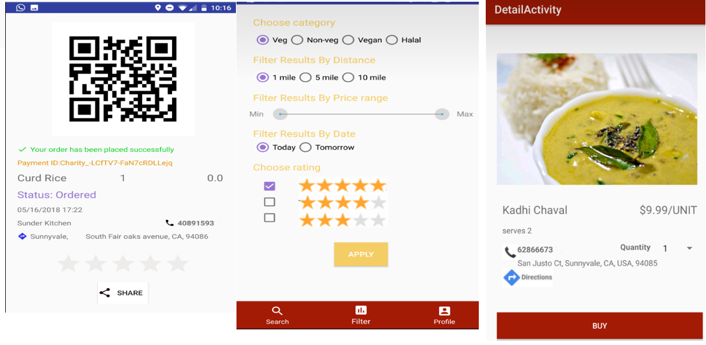

# Android Project
Chef-depot App - Home-prepared food ordering system that can be used by individuals to order food or cook food and publish on the app, for others to order.

## Features :
   • Sign in using phone number as cook/consumer.
   • Free to download and use, available in Google Play stores.
   • Listing of cooks and dishes around user’s location.
   • Payment through PayPal.
   • Scan QR code and verify your identity.
   • Share QR code with others.
   • Easy-to use User interface.
   • Available globally.

## Architecture

            
## Order-Pay Screens

## Search/View orders Screen 

