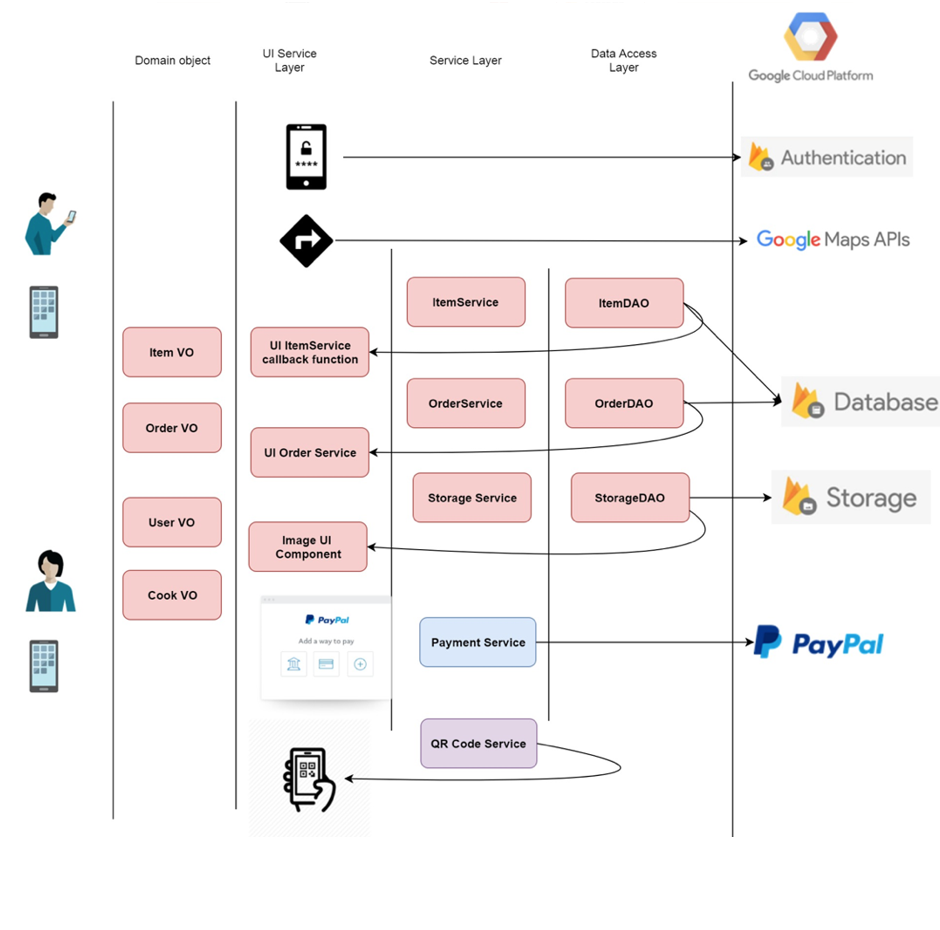
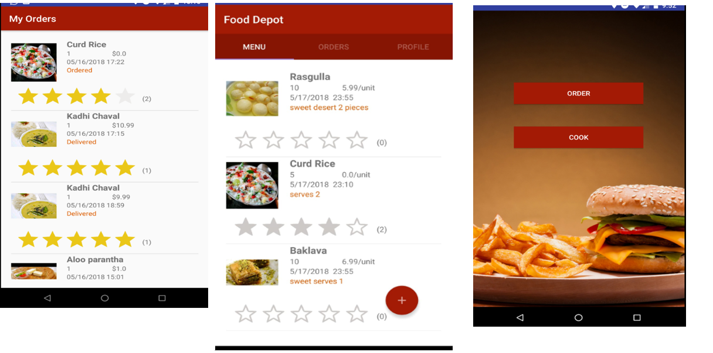

# Android Project
Chef-depot App - Home-prepared food ordering system that can be used by individuals to order food or cook food and publish on the app, for others to order.

## Features :
I.	Sign in using phone number as cook/consumer.
II.	Free to download and use, available in Google Play stores.
III.	Listing of cooks and dishes around user’s location.
IV.	Payment through PayPal.
V.	Scan QR code and verify your identity.
VI.	Share QR code with others.
VII.	Easy-to use User interface.
VIII.	Available globally.

## Architecture

            
## Order-Pay Screens

## Search/View orders Screen 

